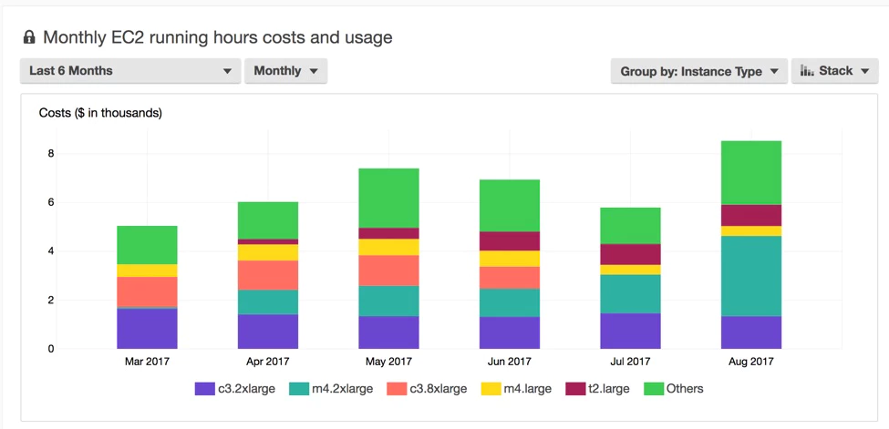
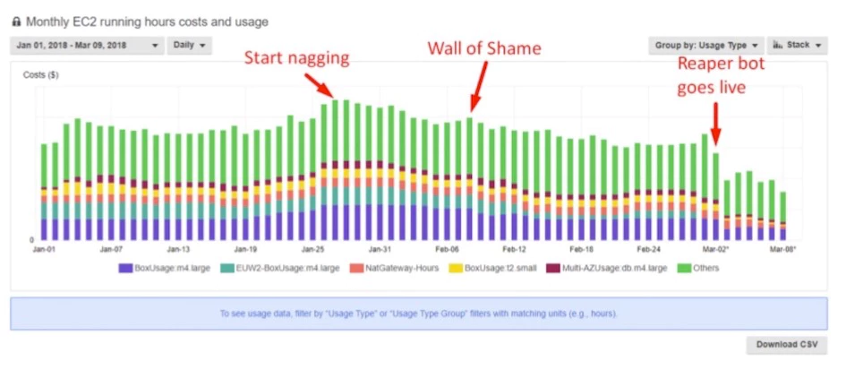
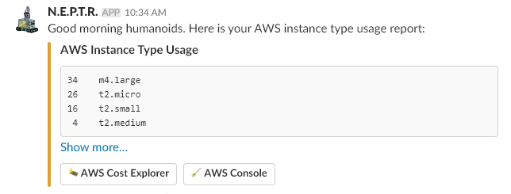

# Lowering Your AWS Cloud Costs

_Are your engineers spending too much money on orphan cloud instances? A simple ChatOps utility built on AWS Lambda can help! This Terraform module will help prevent further Shadow IT practices and replace them with a sprinkle of Infrastructure as Code._

Maybe you've experienced this before: You or your boss are shocked at how expensive your cloud services bill has become. Can you prove that all those cloud instances are being utilized with the greatest possible efficiency? Do you have a way to tag, organize and track all of your instances? If you've lost track of some instances that are no longer necessary, you're basically leaving the water running.

Many companies are dealing with this type of mess because developers and operations wanted a more agile environment to work in, but they didn't have standards or guardrails in place beforehand, and they don't have a plan to clean things up immediately either.

This write up will help you fix both of these problems with AWS-specific code that should still give you a general gameplan even if you want to use a different cloud (IE, Azure or GCP). It's based on the real-life strategies I've implemented in the past to great effect, so give it a try.

### What you'll learn

  - The top 3 methods for cutting cloud costs
  - A real example of 3 tactics used to remove unneeded instances
  - Tools for organizing and tracking your cloud resources with granularity
  - How to deploy our open source ChatOps bot for cleaning up AWS instances
  - How Terraform and Sentinel can help you prevent overspending

#### Who this article is for

This article is relevant for managers and any technical roles tasked with keeping AWS instance costs under control. This may include developers, operations engineers, system administrators, cloud engineers, SREs, or solutions architects.

#### Estimated time to complete

  - 30 minutes to implement the ChatOps bot
  - 35 minutes to implement the Sentinel and Terraform workflow

### A Rogue AWS Org story

In large enterprises, this is a common story.

Engineers are working on tight deadlines, but the operations team needs days or weeks to set up their environments for the building and testing of those new features. So the engineers get permission to move their development and testing workloads to AWS, where they can set up and tear down environments almost instantly.

Unfortunately, those AWS accounts quickly becomes a free-for-all, with engineers buying anything and everything they think they need with no oversight to ensure efficient usage of resources. The result is a huge monthly bill—caused by lots of unused instances, resources and storage that no one bothered to manage or clean up properly.

Now imagine if you can that you are using something to the affect of [AWS Organizations](https://aws.amazon.com/organizations/) and not just gifting environments, but entire accounts to your engineers! Those hard earned and alotted dollars you need for projects, future improvements and promises to customers and business are now being stolen from Peter to pay Paul.

**Congratulations!** You now have the spider web we affectionatley refer to as a **Shadow IT Outlet!**

When management finally says these costs need to come down, it will already become a monumental task just to get visibility into what's going on. Who created all these resources? Looking in the AWS console, it's not clear who created or owns various instances because they can be created without name tags.

If you find yourself in a similar mess, here are the questions you need to get answers to:

  - What are the sizes of our EC2 instances?
  - Which resources are safe to delete or shut down?
  - Where are our instances running? Are they hiding in an unexpected AWS region?
  - Should we really leave all instances running 24/7?
  - Are we consuming much more than we need?
  - How do we clean up this mess?

### Reducing costs: Real-world strategies

  1. The three main ways to cut cloud costs are:
  2. Shut off anything that's not in use.
  3. Take a look at your health checks and CloudWatch logs (for AWS) to determine if you're buying the right sized instances.

After 1 and 2 are under control, get some historical data and make informed purchases of [reserved instances](https://aws.amazon.com/ec2/pricing/reserved-instances/) for your most common instance sizes. You're buying instances in advance, so if you use a lot less than what you pay for, you're not cutting costs—you might actually be making your costs higher.

The remainder of this paper will focus on the first cost-reduction strategy, which usually yields the largest reduction in cloud costs. For the other two strategies, consult these resources:

  - [Identifying Opportunities to Right Size](https://docs.aws.amazon.com/aws-technical-content/latest/cost-optimization-right-sizing/identifying-opportunities-to-right-size.html)
  - [Cost Optimization: EC2 Right Sizing](https://aws.amazon.com/answers/account-management/cost-optimization-ec2-right-sizing/)
  - [The Ultimate Guide to AWS Reserved Instances](https://www.cloudhealthtech.com/blog/ultimate-guide-aws-reserved-instances-part-1-planning-and-analysis)

#### Know where your money is going

In order to _shut off anything that's not in use,_ you'll need to start by identifying instances and resources that are safe to shut off. With the amount of tools out there that are available for this it can seems like a daunting task. Luckily though for AWS, your go-to tool will be one of my all time favourites, AWS [Cost Explorer](https://docs.aws.amazon.com/awsaccountbilling/latest/aboutv2/cost-explorer-what-is.html).

Take a look at this graph from the Cost Explorer:

This stacked bar graph shows the expenses from each instance type over time. You can also group by usage type, custom tags, and more.

### The importance of tagging

AWS has a very flexible tagging system. With that flexibility though comes the need for your team to devise and enforce its own standard tagging system, so that there aren't any questions about what resources are for and who created them. When used properly, tags can tell you exactly what each resource is used for and who created it. This brings accountability to the team and their management of cloud costs.

After you've gotten familiar with the Cost Explorer, the next step should be to have your primary AWS operators create tagging standards and document them for team visibility. The most useful instance tags (especially for the purposes of the demo below) are TTL (time-to-live) and owner. Time-to-live is the time limit you put on the life of your instance, which is crucial for identifying what's not in use.

Later in this paper, I'll show you a tool that can enforce your tagging standards using more than just a stern email.

### How much can you save? A real-world example

Everyone has its own challenges with keeping AWS costs down. I use the same strategies described above plus a few more described below. The most effective tool was a ChatOps utility I built called "NEPTR." (codename: "Reaper"). The reaper bot cleans up unused and expired AWS instances on a regular schedule.

You can see the effect of each strategy in the AWS resource utilization graph below:

This graph shows where each successive action occurred, and how much it drove costs down. The three actions included:

  1. **Start nagging:** Send a notification to all AWS operators to clean out unused instances.
  2. **Wall of Shame:** Encourage a bit of peer pressure with the _Wall of Shame_ which put operators with the most untagged instances on our reaper bot's Slack report.
  3. **Reaper bot goes live:** This is when I set the reaper bot loose. It turned off or deleted any instances that didn't have the proper TTL tagging. You'll want to give your team several warnings to ensure that the most important and permanent processes are whitelisted before this last step.

  You can see which step had the biggest impact. While the reminders can be helpful, there are ultimately a lot of unnecessary instances that operators lose track of without a strict tagging system. It's not uncommon to see a 30-40% drop in your daily cost. I also found that EC2 compute is the most frequently wasted resource type.

So how do you deploy a reaper bot of your own? You'll be happy to know that if you go [here](https://github.com/ehime/terraform-neptr) you have the code for Reaper, as well as instructions on how to install and run it. The reaper bot is a serverless application that runs on AWS Lambda, so it's easy to run. It's also push button to deploy due to the fact that the infrastructure was written with Terraform.

### After deploying the ChatOps bot

Here's what the reaper bot can do:

  - Whitelist resources to prevent the bot from touching them.
  - Check for mandatory tags on AWS instances and notify people via Slack if untagged instances are found. (_We can identify the SSH key name, if it was provided, and if the name identifies a person, we can track them down_)
  - Post a Slack report with a count of each instance type currently running across all regions.
  - Shutdown untagged instances after _X_ days.
  - Delete untagged instances after _Y_ days.
  - Delete machines whose TTL has expired.
  - And of course, it's open source, so you can modify the code to add more features like managing NatGateways or RDS instances.

Remember that this bot can delete live AWS instances, so make sure the engineer deploying this understands the bot's code, your systems running on AWS, and holds a review process involving multiple operators.

Here's what the reports looked like in Slack:

